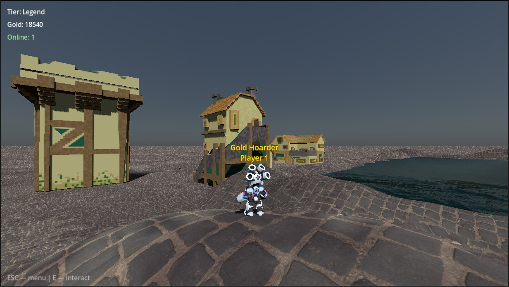
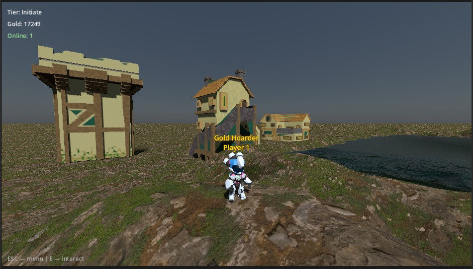
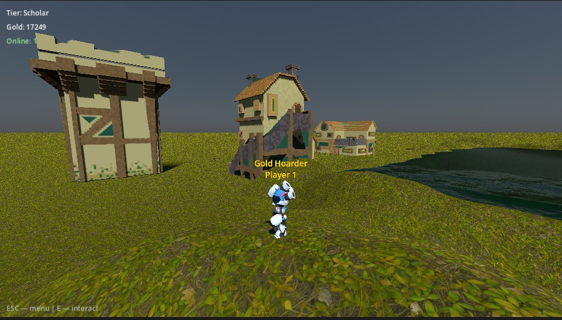
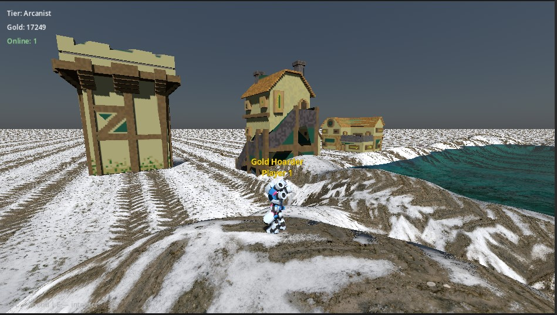
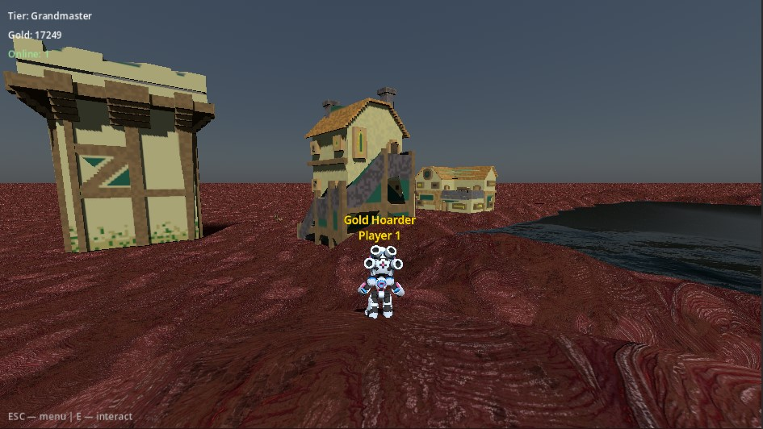
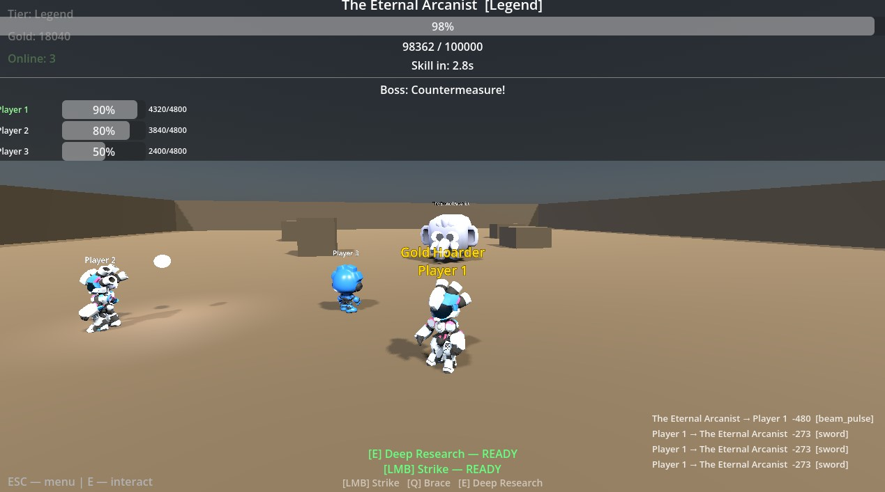
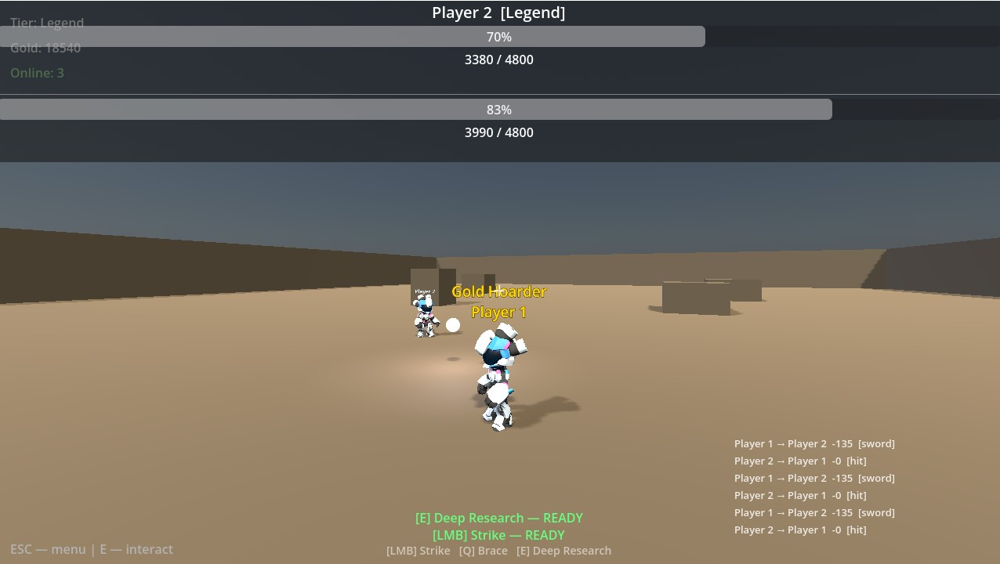
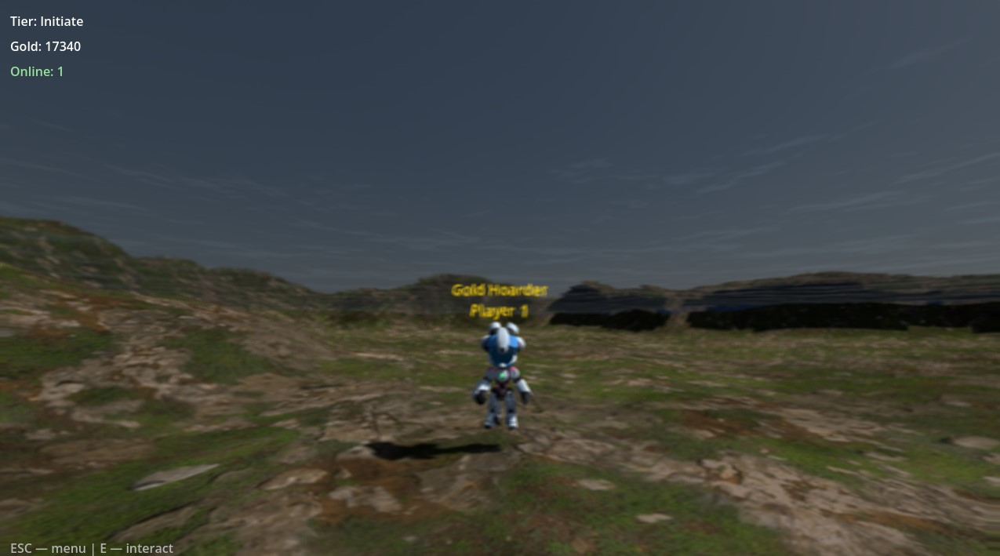

# World Scale

**Your career is your character.**

World Scale is a free 3D multiplayer RPG for Windows and macOS where your
real-world professional credentials — papers published, code shipped, patients
treated, cases won, art released — are scored into a power level. Explore a
living world with other players, duel them for gold, and team up to bring down
raid bosses.

**[▶ Watch the full walkthrough on YouTube](https://youtu.be/ku26IHZINKQ)** — from signup to a co-op boss raid in 20 minutes.

---

## How it works

1. **Create an account** and enter your credentials in any of **five realms**:
   **Academia · Tech · Medicine · Creative · Law**. Years active, h-index,
   GitHub stars, patients treated, cases won — each realm has its own metrics.
2. Your inputs are scored against **realistic professional cohort
   distributions** (percentile-based, not linear — a 60 h-index really is
   rare) and combined into a single **power score**.
3. Power places you in one of **15 tiers**, from **Apprentice** to **Legend**.
   Your tier decides which themed realm you explore and which boss you face.
4. Walk into the world. Everyone you see is a real player.

You can enter multiple realms — a doctor who codes scores in both Medicine and
Tech, and both count toward your total power.

## Features

- **Fifteen tier-themed realms** — the world's terrain changes with your
  rank: gravel coasts, grasslands, snowfields, volcanic rock, city
  cobblestone… and yes, you can walk into the lake.
- **PvP duels** — walk up to another player, press `E`, and challenge them.
  Winner takes a cut of the loser's gold.
- **Battle insurance** — hedge your duels before they start:

  | Policy | Premium | Refund on gold lost |
  |--------|---------|--------------------|
  | Bronze | 30 gold | 25% |
  | Silver | 60 gold | 50% |
  | Gold   | 100 gold | 75% |

- **Co-op boss raids** — every tier has its own boss (meet *The Hollow
  Golem*, *Sable Witch*, *The Pale Surgeon*… and at the very top, *The
  Eternal Arcanist*). Fight solo or invite up to **3 players** into the lobby.
  Bosses telegraph skills and drop gold for the whole party.
- **Realm skills** — your dominant realm gives you a signature combat skill
  (an academic casts *Deep Research*; every realm fights differently).
- **Economy & cosmetics** — spend gold on titles and name borders in the
  store. Flaunt *Gold Hoarder* above your head if you must.
- **Hall of Legends** — a live top-10 leaderboard of the most powerful
  professionals in the world.
- **In-game account management** — password reset by emailed 6-digit code,
  name changes, account deletion — no website needed.

## Screenshots

| | |
|---|---|
|  *Starting out on the coast* |  *Scholar-tier grasslands* |
|  *Arcanist-tier snowfields* |  *Grandmaster-tier volcanic wastes* |
|  *Three players raiding The Eternal Arcanist* |  *A duel for gold* |
|  *Under the lake* | |

## Download & play

- **[Download on itch.io](https://tianyang1998.itch.io/world-scale)** — recommended
- **[GitHub Releases](../../releases)** — `WorldScale-Windows-v1.0.0.zip` / `WorldScale-Mac-v1.0.0.zip`

### Windows

1. Extract `WorldScale.zip`.
2. Keep `WorldScale.exe` and the `.dll` file together in the same folder.
3. Double-click `WorldScale.exe`.

### macOS

1. Double-click `WorldScale.zip` to extract `WorldScale.app`, then open it.
2. If macOS warns that it *"cannot check the app for malicious software"* —
   normal for a free, unsigned app — right-click (Control-click) the app and
   choose **Open**, then click **Open** in the dialog. On the newest macOS
   versions, go to **System Settings → Privacy & Security** and click
   **Open Anyway** instead. You only need to do this once.

**Controls:** `WASD` move · mouse look · `E` interact/challenge ·
`LMB` strike · `Q` brace · `ESC` menu

## Under the hood

World Scale Desktop is a solo-built game, written from scratch in **Godot 4.6**
(Forward+, GDScript) as a 3D reimagining of my earlier World Scale web game:

- **Backend:** Supabase — email auth, Postgres with row-level security
  (players can only ever write their own row; the public leaderboard is
  served through a column-safe SQL view), REST persistence.
- **Multiplayer:** the client speaks the Phoenix channel protocol directly
  over a raw `WebSocketPeer` — presence and broadcast channels drive the
  shared world map, duel/raid lobbies, and battle events. No game servers.
- **Deterministic core:** scoring, battle math, and the economy live in
  stateless logic classes covered by GdUnit4 unit tests.
- **World:** Terrain3D heightmap terrain with per-tier theming, CC0 voxel
  architecture, and GDQuest robot characters.

The source code is proprietary and not part of this repository.

## Feedback → v2

World Scale v2 is planned as a ground-up rebuild in **Unreal Engine** — and
**every piece of player feedback on this version will be considered for it**.

- 🐛 Bugs, ideas, balance complaints: **[open an issue](../../issues)**
- 📧 Anything else: **worldscaleplate@gmail.com**

## Privacy & credits

- [Privacy policy](privacy-policy.md) — what's stored (your email, your
  self-reported credentials, your character) and your rights over it.
- [Credits](CREDITS.md) — music, models, and textures used by the game,
  each under its own license.

World Scale is free to play, now and always.

---

© 2026 Tianyang Liu. Game content and source code all rights reserved;
third-party assets credited in [CREDITS.md](CREDITS.md).
